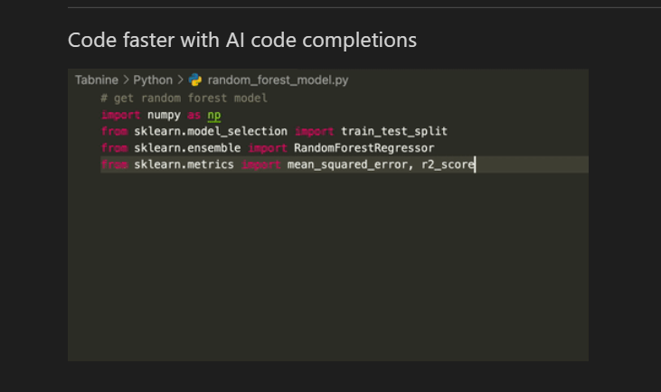

# Tabnine

## install
<https://www.tabnine.com/install/>

## Features(These words are generated by chatgpt)
"TabNine is a machine learning-based code autocompletion tool that can be used in various editors and IDEs, including but not limited to VS Code, Sublime Text, PyCharm, Vim, Emacs, and more. Unlike traditional code autocompletion tools, TabNine not only completes based on existing code snippets and syntax rules, but can also generate entirely new code by learning from large code repositories and language syntax, significantly improving coding efficiency and accuracy.

The advantages of TabNine include:

+ High accuracy: TabNine is trained using machine learning algorithms and can generate the most appropriate code completion options based on the code context.
+ Cross-language support: TabNine supports multiple programming languages, including Python, JavaScript, Java, C++, Go, Ruby, and more.
+ Fast response: TabNine's completion response speed is very fast and can easily handle large projects and complex code structures.
+ Intelligent prediction: TabNine can intelligently predict the next possible code completion option based on context and history, making coding smoother and more efficient.
+ Easy to customize: TabNine supports user-defined configuration and extension, allowing customization of the tool based on personal needs.

By providing high-quality code completion options, TabNine reduces the time and error rate of writing code and is a highly valuable and practical programming tool."

## The difference with copilot
"TabNine and Copilot are both machine learning-based code autocompletion tools that can generate code completion options based on context and syntax rules to improve coding efficiency and accuracy. However, there are some differences between them.

Firstly, they are developed by different companies, with TabNine being developed by Codota and Copilot being developed by OpenAI.

Secondly, they have different training data sources. TabNine uses both public and private code repositories from GitHub, while Copilot uses public code repositories from GitHub and OpenAI's own internal code repositories.

Thirdly, TabNine supports multiple programming languages, including Python, JavaScript, Java, C++, Go, Ruby, and more, while Copilot currently only supports Python, JavaScript, and TypeScript.

Fourthly, TabNine focuses on code completion and intelligent prediction, while Copilot's unique feature is the ability to generate code snippets and functions, even based on natural language descriptions.

Finally, TabNine's code is mostly open source, allowing users to customize and extend the tool, while Copilot does not currently support customization and is not open source due to its use of OpenAI's GPT series models.

Overall, both TabNine and Copilot are valuable code autocompletion tools with their own strengths and suitable use cases. Users can choose the appropriate tool based on their needs."

## preview
 
