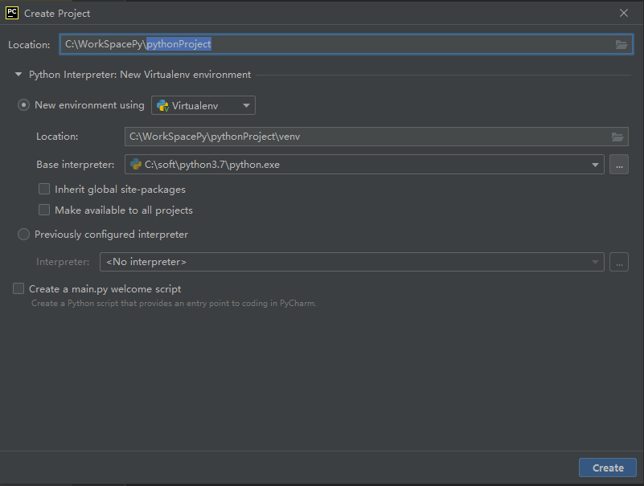

# PyCharm

## 1.首先我们要进行Pyhton解释器的下载

```python
print('Hello World')
```

Python 不能直接在计算机中运行，因此需要 Python 语言的运行环境： Python 解析器

下载地址：<https://www.python.org/downloads/release/python-379/>
当然你安装3.8或者3.9也是没问题的

查找目标文件：Windows x86-64 executable installer -- 单击即可下载。(格式不能找错)

## 2.Python解析器的安装

第一步：双击运行 Python 的解析器，选择 ==自定义安装== 以及 ==添加 Python 到环境变量(这一步非常重要)==

第二步：选择所有要安装的功能菜单，默认全部勾选

第三步：设置 Python 解析器的安装路径，尽量不要安装在C盘，但需要知道自己安装的位置

第四步：测试 Python 解析器是否可以使用
方法：按 Windows + R ，输入 cmd ，打开 Windows 的 DOS 窗口，输入 python（全部小写）,当出现下图就成功了


使用exit()退出

## 3. Python开发工具PyCharm(我下载的是2021.2.1)新版容易出现位置问题

在不涉及到人工智能的方向，推荐不用安装 anaconda ，直接安装 PyCharm 即可。它是目前功能最强大的 IDE

PyCharm 一共有两个版本：专业版（收费） 与 社区版（免费、开源）。我们选择后者

第一步：下载 PyCharm 。<https://www.jetbrains.com/pycharm/download/>

第二步：设置软件的安装路径，不用安装在 C 盘

第三步：PyCharm 基本设置。如下图设置，不建议把 Pycharm 添加到环境变量里面


## 4.创建Python项目

第一步：创建项目 **(Pycharm 不要汉化！不要汉化！不要汉化！)**

点开图标，初次点开会有一个提示窗口，不用管他，点击 New Project


第二步：设置项目路径，尽量放到 C 盘以外（非常重要！！）

你会看到类似如下图片。(因为我使用的是虚拟机安装，只用于开发 pycharm ，只有一个盘所以放在了 C 盘)



其中 base interpreter 会自动感知到 python.exe 的位置，没感知到可以手动定位(找到 python 安装路径然后选定 python.exe )

新建文件并书写代码

```python
print('Hello World')
```

进行运行，右上角绿色的三角符号 Run 。

结果如下，就完成啦。


